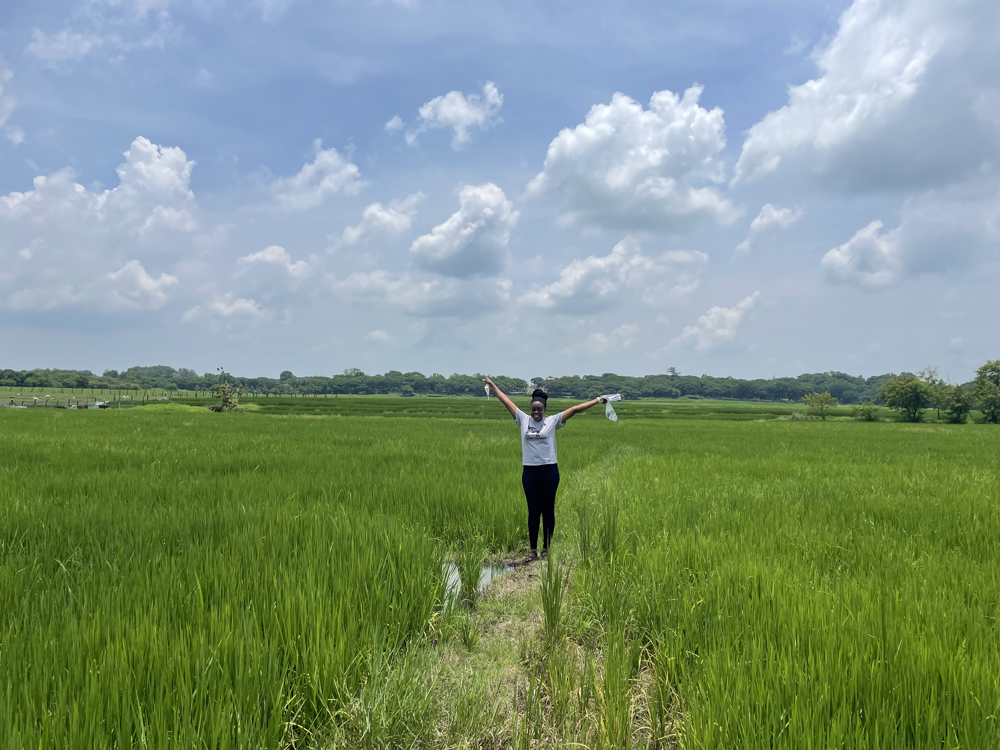

Welcome! My name is **Uzezi Okinedo**, and I am a Biology Ph.D. candidate in Moyers lab at **UMass Boston**. My research focuses on **plant genomics** and **evolutionary biology**.

### Research Interests
My research area is in plant genomics and evolutionary biology. I employ computational genomics approaches, computer vision strategies, and evolutionary models to answer questions on how plants thrive in different environments and to understand the genetic basis of trait variation. I use this information to identify plant types that can be harnessed for conservation purposes or selective breeding. 

### Applications
My work identifies plant types that can:
- Be harnessed for **conservation purposes**.
- Aid **selective breeding** for agriculture and sustainability.

### Contact Me
Feel free to reach out or follow my work:
- [GitHub](https://github.com/Uzezi93)
- [LinkedIn](www.linkedin.com/in/uzezi-okinedo-978bb0110)
- [Email Me](mailto:Uzezi.Okinedo001@umb.edu)
