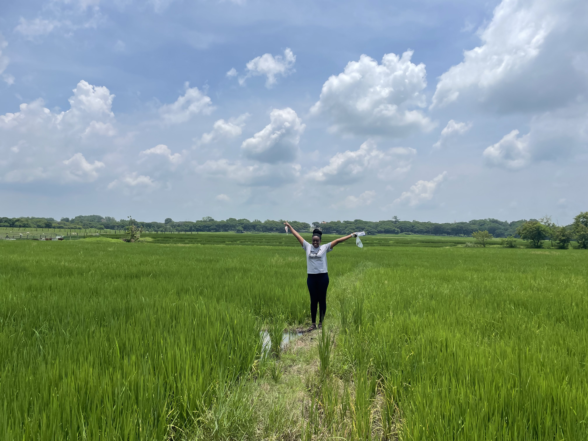

<!-- Top Navigation with Logo Links -->

  
  
  

<!-- About Me Section -->

  <h1>Welcome to my website </h1>
  
Biology Ph.D. candidate at <strong>UMass Boston</strong>

  
My research focuses on <strong>plant genomics</strong> and <strong>evolutionary biology</strong>

  

---

## Research Interests

I employ a variety of tools to explore my research, including:

- **Computational Genomics**: Understanding the genetic basis of trait variation.
- **Computer Vision Strategies**: Leveraging advanced image analysis techniques for plant phenotyping.
- **Evolutionary Models**: Investigating how plants adapt to diverse environments.

---

## Applications

My work identifies plant types that can:

- Be harnessed for **conservation purposes**.
- Aid **selective breeding** for agriculture and sustainability.

---

## Contact Me

Feel free to reach out or follow my work:

- [GitHub](https://github.com/Uzezi93)
- [LinkedIn](https://www.linkedin.com/in/uzezi-okinedo-978bb0110)
- [Email Me](mailto:Uzezi.Okinedo001@umb.edu)

---

Thank you for visiting my page! You can follow my work and get in touch through the links above.
